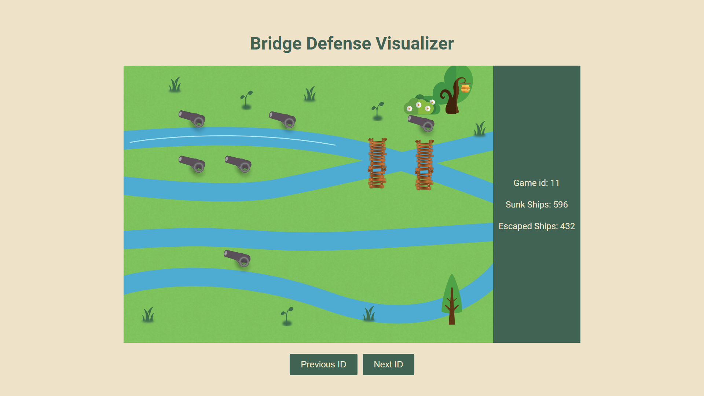

# REST-API-SERVER
Uma dos desafios tecnológicos da comunicação em redes é abstrair as trocas de mensagens entre computadores como chamadas de funções. Protocolos de chamada de procedimento remoto (RPC) resolvem esse problema definindo como comunicações entre pares devem se comportar, a fim de deixar a rede transparente para o usuário.

Nesse trabalho, utilizamos a interface REST sob o protocolo HTTP para criar uma arquitetura cliente servidor, onde o servidor é responsável por manipular uma base de dados remota. O projeto foi implementado em python 3.8 utilizando a biblioteca Flask para a construção da API.

Além disso, foi implementado uma interface Web com HTML e JavaScript que permite visualizar os jogos que se aconteceram. 
## Como executar os programas
Como o projeto possui uma série de dependências, a execução está atrelada a um ambiente virtual. Junto ao código fonte, existe um arquivo ```Makefile``` para tanto gerar o ambiente, quanto executar os programas
### Pré-requisitos
Primeiro, é necessário executar o comando para gerar o variável de ambiente.
```
make env
```
Se este comando não for executado no início, ele será executado na primeira vez que algum comando de execução for chamado;
### Servidor
Com a env criada, basta executar o seguinte comando para executá-lo 
```
make run_server
```
Ou, de maneira direta (com a env ativada)
```
python3 Server/server.py 
```
### Cliente
Para executar o cliente, utilize o comando a seguir. Você pode passar argumentos para especificar o IP, a porta, o tipo de análise e o arquivo de saída.
```
`make run_client CLIENT_IP=<IP> CLIENT_PORT=<PORT> CLIENT_ANALYSIS=<ANALYSIS> CLIENT_OUTPUT=<OUTPUT>`
```
#### Argumentos para o Cliente
- **`CLIENT_IP`**: IP do servidor (padrão: `127.0.0.1`).
- **`CLIENT_PORT`**: Porta do servidor (padrão: `5000`).
- **`CLIENT_ANALYSIS`**: Tipo de análise a ser realizada (padrão: `1`).
- **`CLIENT_OUTPUT`**: Nome do arquivo de saída (padrão: `output.csv`).

## Decisões de Projeto
Para o desenvolvimento do backend, optamos por utilizar a biblioteca Flask em conjunto com Flask-RESTX. A escolha do Flask se deve a sua simplicidade e flexibilidade, que são ideais para criar APIs rapidamente.
**Flask-RESTX** foi escolhido para adicionar funcionalidades específicas para construção de APIs RESTful, como:
- **Documentação Automática:** Geração automática de documentação da API.
- **Validação de Dados:** Facilidade para definir e validar schemas de entrada e saída.
#### Configuração do Ambiente

**Desafio:** Gerenciar o ambiente e as dependências do projeto, garantindo que todos os pacotes e bibliotecas necessários fossem instalados corretamente.

**Solução:** Utilizamos o `Makefile` para automatizar a criação do ambiente Conda e a instalação das dependências. Isso ajuda a garantir que todos os desenvolvedores e usuários finais tenham um ambiente consistente.
## Aplicação Frontend
A aplicação é responsável por apresentar visualmente os dados de jogos e rankings obtidos da API. Ela oferece uma interface interativa para visualizar a posição dos canhões e as estatísticas de jogo, como o número de navios afundados e escapados. A aplicação foi desenvolvida utilizando HTML, CSS e JavaScript.




Para executar a aplicação, devemos 
1) manter o servidor em execução por meio do comando:
```
make run_server 
```
O servidor estará disponível em `http://127.0.0.1:5000`
2) Abrir o arquivo `Frontend/page.html` em seu navegador
## Documentação Automática da Api
O Flask-RESTX é uma extensão do Flask que simplifica a criação de APIs RESTful ao fornecer recursos avançados como documentação automática, validação de dados e organização de rotas por meio de namespaces. No projeto, o Flask-RESTX é empregado para estruturar as operações do servidor de forma eficiente.

Ele gera automaticamente a documentação da API, facilitando para os desenvolvedores a compreensão dos endpoints disponíveis, dos parâmetros necessários e dos dados esperados. Essa documentação é acessível através da interface Swagger UI, que é integrada automaticamente ao projeto.

### Organização por Namespaces

Os namespaces no Flask-RESTX ajudam a organizar as rotas da API de maneira lógica e modular. Nesta aplicação, dois namespaces principais foram definidos:

1. **Game Namespace** (`game_ns`): Lida com operações relacionadas a jogos individuais, como a obtenção de detalhes de um jogo específico por seu ID.    
2. **Rank Namespace** (`rank_ns`): Fornece operações para consultar rankings baseados em métricas específicas, como o número de navios afundados ou escapados.

O Flask-RESTX permite definir modelos de dados que estruturam e validam as informações trocadas pela API. Isso assegura que os dados enviados e recebidos estejam de acordo com o formato esperado.
